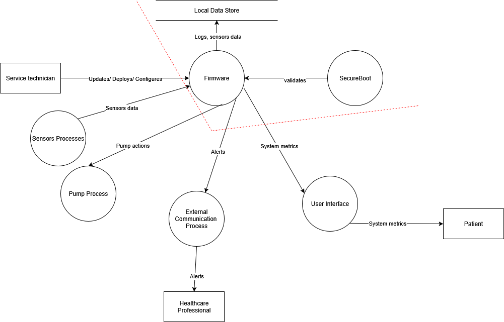
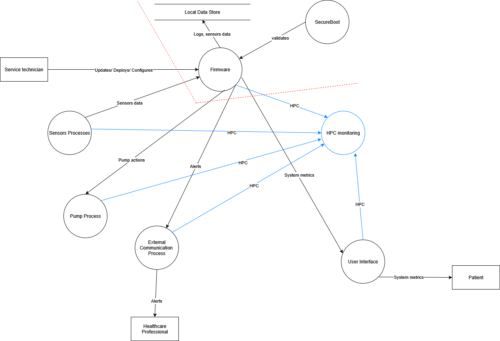

# Hardware performance-counter based malware detection on resource-constrained embedded systems

This repository contains the work I did during my master's thesis titled **"Hardware performance-counter based malware detection on resource-constrained embedded systems."**

The goal of this thesis is to evaluate whether software exploitation can be detected using hardware performance counters (HPC) on RISC-V embedded systems.

In it you'll find a folder called "GvSOC" containing the code used to extract HPCs and simulate a buffer overflow. You will also find in this folder the csv file containing the HPCs for each program execution and a python script for displaying a graph of normalized metrics based on the number of instructions executed. I will also create a folder called "Chipyard" in which I will add my current work based on a BOOM core.

Link to the [overleaf](https://www.overleaf.com/project/6875568b9e3e4952bfc323a6)
## Methodology 

1. **Literature Review**
   - Studied RISC-V architecture and various RISC-V simulators.
   - Learned about the uses of HPCs for anomaly detection.
   - Reviewed common software exploitation techniques and RISC-V specificities.

2. **Initial Experiments**
   - First experiments aimed to simulate a simple buffer overflow and observe HPC behavior during exploitation.
   - Started using **Chipyard**, but encountered difficulties in accessing HPC data.
   - Researched related academic papers and found one using **GVSOC** for a similar purpose.

3. **Switch to GVSOC**
   - Successfully simulated simple buffer overflow attacks and collected HPC data.
   - However, the software exploitation using GvSOC were limited (no OS, minimal libc, no input).

4. **Switch to Chipyard BOOM**
   - Created new HPC counters in BOOM core.
   - Still had limitation (no OS, minimal libc)
   - Can not run linux

5. **Switch to Chipyard Rocket Core**
   - Created new HPC counters in Rocket.
   - Can run linux
   - Nexys Video limitation

6. **Switch to Rocket Core**
   - In progress
   - Can run linux
   - Following https://github.com/eugene-tarassov/vivado-risc-v

## Current Results

- Ran and monitored a basic buffer overflow attack using **GVSOC** and the **PULP RI5CY core**.
- Collected HPC data during both normal and exploited execution flows.
    - Due to GvSOC limitations, gathered the results only at the end of the execution flow.
- No clear or consistent anomalies were observed in the perfomance counters provided by the RI5CY core.
    - Need more counters and more realistic/complex software exploitation.

## Research Questions

1. **Can HPCs be used to detect software exploitation on embedded RISC-V systems?**
2. **What kind of HPC patterns or anomalies correspond to such exploitations?**
3. **Would creating new hardware performance counters improve detection capabilities? If so, what kind of counters would be most effective?**

## Planned Thesis Structure
1. **Introduction**
   - Research Objectives  
   - Research Questions  
2. **Literature Review**
    - Embedded and IOT Security Landscape
        - Security Challenges in Embedded and IOT Devices
    - Software exploitation and Malware in Embedded systems
        - Malware in Embedded systems
        - Software exploitation in Embedded systems
    - Usage of HPC in software exploitation and malware detection
    - Limitation of HPC in software exploitation and malware detection
3. **Methodology**
    - Research Methodology
    - Threat Model
    - Detection Architecture
    - FPGA Implementation
4. **Implementation**
    - PULP Implmentation
    - Custom HPC Implementaion in Chipyard
    - FPGA
    - Tool Development
    - Validation and Verification
5. **Dataset Generation and Automation**
6. **Experimental Evaluation**
7. **Results**
8. **Conclusion**

## Threat Modeling 

Insulin Pump

RISC-V Microcontroller 
- Get Data from glucose sensors
- Send System logs
- Activates the Insulin Pump with the right dosage based on the glucose level
- Raise alerts to Healthcare professionals using a communication channel (Bluetooth, Wifi) in case of urgency

Local Data Store
- Keeps Logs and glucose levels historic
Sensors 
- Track glucose levels and send it to the Microcontroller
Pump
- Control the level of glucose sent to the patient
External Communication 
- Wifi or bluetooth used to contact healthcare professionals

User Interface
- LCD screen showing the system metrics and possible system issues
SecureBoot
- Check the firmware to be sure it was not altered

# System Diagram without HPC
Assuming that every threat not related to HPC is already handled 

Focus on Internal components
Firmware Trusted because of SecureBoot 
Local Storage Trusted -> assuming there will be no physical tampering

Sensors Processes

- S: Attacker could pretend to be a sensor
	- Software exploitation ?
- T: Attacker could tamper with the data before it arrives to the firmware
	- Software exploitation ?
- D: Attacker could send more sensor data to cause a DOS

Pump Process

- T: Attacker could cause the Pump to send too much/few glucose to the patient
- D: Attacker could cause to the Pump to be unaccessible 

External Communication Process

- T: Attacker could cause alerts to be sent to healthcare without real alerts or real alerts not to be sent
- D: Attacker could make the Communication channel to go offline 

User interface

- T: Attacker could show fake data to the patient

Service Technician
- S: Attacker could take the credentials of the technician and update the firmware.
	- Software exploitation ?
- T: Attacker could tamper with the update to introduce vulnerabilities

# System Diagram with HPC

Assuming a full anomaly detection, the detection can 

- detect software exploitation
- tampering detection needs to be evaluated
- DOS detection needs to be evaluated

However, new threats appears with the new detection process.

HPC monitoring 

- T: Attacker could change the counters and evade detection
- I: Attacker could access the counters and know the behaviour of the systems
- D: Attacker could make the detection take more ressource to DOS the ressource contrained system

Mitigation:

- Enclave solve T and I
- DOS is difficult to mitigate, (experimentation to evaluate the feasibility ?)

